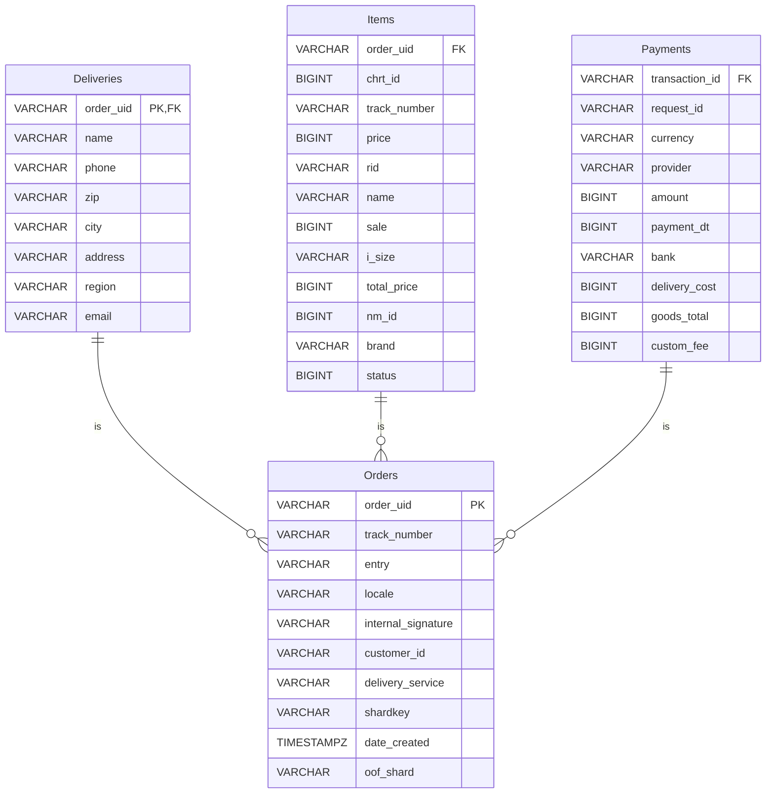

# Демонстрационный сервис, отображающий данные о заказе
Необходимо разработать демонстрационный сервис с простейшим интерфейсом, возвращающий данные о заказе.

## Run
```shell
# postgres db
docker compose -f ./docker-compose.yml rm && \
docker compose -f ./docker-compose.yml build --no-cache && \
docker compose -f ./docker-compose.yml up

# app
cargo run
```

**Модель данных в формате JSON**
```json
{
  "order_uid": "b563feb7b2b84b6test",
  "track_number": "WBILMTESTTRACK",
  "entry": "WBIL",
  "delivery": {
    "name": "Test Testov",
    "phone": "+9720000000",
    "zip": "2639809",
    "city": "Kiryat Mozkin",
    "address": "Ploshad Mira 15",
    "region": "Kraiot",
    "email": "test@gmail.com"
  },
  "payment": {
    "transaction": "b563feb7b2b84b6test",
    "request_id": "",
    "currency": "USD",
    "provider": "wbpay",
    "amount": 1817,
    "payment_dt": 1637907727,
    "bank": "alpha",
    "delivery_cost": 1500,
    "goods_total": 317,
    "custom_fee": 0
  },
  "items": [
    {
      "chrt_id": 9934930,
      "track_number": "WBILMTESTTRACK",
      "price": 453,
      "rid": "ab4219087a764ae0btest",
      "name": "Mascaras",
      "sale": 30,
      "size": "0",
      "total_price": 317,
      "nm_id": 2389212,
      "brand": "Vivienne Sabo",
      "status": 202
    }
  ],
  "locale": "en",
  "internal_signature": "",
  "customer_id": "test",
  "delivery_service": "meest",
  "shardkey": "9",
  "sm_id": 99,
  "date_created": "2021-11-26T06:22:19Z",
  "oof_shard": "1"
}
```

## API Description
```http request
### Example order
GET http://localhost:8000/orders/b563feb7b2b84b6test HTTP/1.1
Host: localhost:8000
Content-Type: application/json
Accept: */*
```

```http request
POST http://localhost:8000/orders HTTP/1.1
Host: localhost:8000
Content-Type: application/json
Accept: */*

{
  "order_uid": "test1september2024",
  "track_number": "MRBEAST",
  "entry": "OZON",
  ...
}
```

## DB Schema



# Затронутые темы: Заметки
## Axum (без middleware), разделяемое состояние
## Rust: логирование
## Опционально: Rust: unit-тесты
## Rust: clippy
## Rust: таймауты
## Опционально: бенчмаркинг
## Опционально: обработка аргументов командной строки (clap)
## Сериализация/десериализация (serde, json)
## Опционально: БД/транзакции
## разделяемые данные через Arc


# Refs.
- [Rust CRUD API Example with Axum and PostgreSQL](https://codevoweb.com/rust-crud-api-example-with-axum-and-postgresql/)
- [Rust Axum Full Course - Web Development (GitHub repo updated to Axum 0.7)](https://www.youtube.com/watch?v=XZtlD_m59sM)
- [Build a CRUD REST API with Rust Axum | Tutorial](https://www.youtube.com/watch?v=NJsTgmayHZY)
- [SQLx is my favorite PostgreSQL driver to use with Rust.](https://www.youtube.com/watch?v=TCERYbgvbq0)