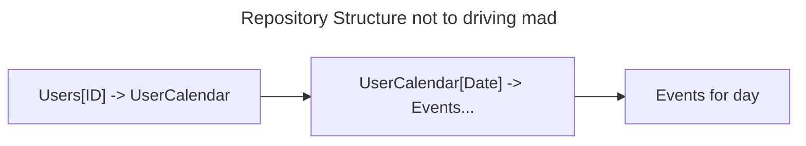

# L2.11 HTTP-сервер

## Задача
Реализовать HTTP-сервер для работы с календарем. В рамках задания необходимо использовать веб-фреймворк axum.


## Требования
1. Реализовать вспомогательные функции для сериализации объектов доменной области в JSON. 
2. Реализовать вспомогательные функции для парсинга и валидации параметров методов /create_event и /update_event. 
3. Реализовать HTTP обработчики для каждого из методов API, используя вспомогательные функции и объекты доменной области. 
4. Реализовать middleware для логирования запросов 
5. Реализовать все методы. 
6. Бизнес логика не должна зависеть от кода HTTP сервера. 
7. В случае 
   - ошибки бизнес-логики сервер должен возвращать HTTP 503. 
   - ошибки входных данных (невалидный int например) сервер должен возвращать HTTP 400. 
   - остальных ошибок сервер должен возвращать HTTP 500. Web-сервер должен запускаться на порту указанном в конфиге и выводить в лог каждый обработанный запрос.

## Структура проекта
Методы API: 
```http request
POST /create_event 
###
POST /update_event
###
POST /delete_event
###
GET /events_for_day
###
GET /events_for_week
###
GET /events_for_month
```

Параметры передаются в виде www-url-form-encoded (т.е. обычные user_id=3&date=2019-09-09). В GET методах параметры передаются через queryString, в POST через тело запроса.

В результате каждого запроса должен возвращаться JSON-документ содержащий либо {"result": "..."} в случае успешного выполнения метода, либо {"error": "..."} — в случае ошибки бизнес-логики.

